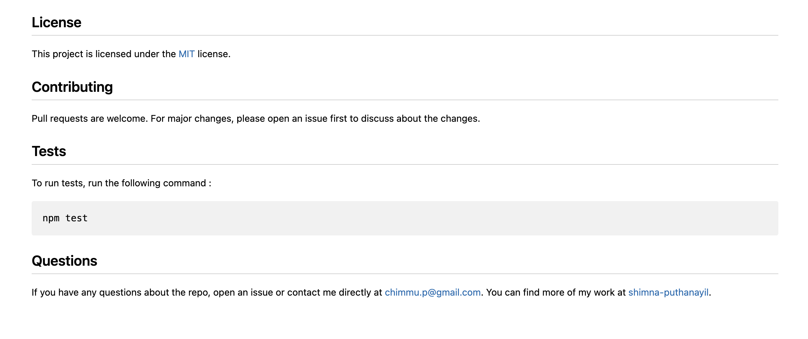

# Professional README Generator 

## Description

This command-line application dynamically generates a professional README file from a user's input. The user can give information about the new repository based on which a project README.md will be generated with the title of project and sections entitled Description, Table of contents, Installation, Usage, License, Contributing, Tests and Questions. The README file contains a badge  at the beginning after the title for the license the application is covered under. It also includes the user's GitHub username and the link to the GitHub profile in the section 'Questions'.

## Installation

- Install Node.js v16 
- Clone the Repository from GitHub
- Go to the folder 'Develop' and install  necessary dependencies running the following command :

  ```
  npm i 
  ```

## Usage

The user is prompted with a series of questions for information about the application repository when the application is run (by right clicking on the folder 'Develop' and then Open in Integrated Terminal will result in displaying the terminal. After the terminal is opened type node index.js to run the application). These questions include GitHub username, email address, project's title, short description of the project, license the project is covered under (the user has to choose the license from a list of licenses), command needed to install the dependencies and tests, usage instructions and how to contribute to the project. After all the questions are answered a success message will be displayed and a README.md file will be generated in to the folder 'output'.

#### Link to walkthrough video :

https://drive.google.com/file/d/1BEewN_9EPnwimxv9JEWVzNR7HlbsVrFS/view

#### Link to generated README.md :

https://github.com/shimna-puthanayil/project-doc-generator/blob/main/Develop/output/README.md

The following images show the application's appearance and functionality :


 #### README.md


#### Preview of README




## Credits

#### References

https://gist.github.com/lukas-h/2a5d00690736b4c3a7ba

https://meta.stackexchange.com/questions/82718/how-do-i-escape-a-backtick-within-in-line-code-in-markdown

## License

[MIT](https://opensource.org/licenses/MIT) license.
